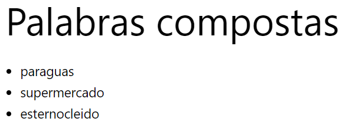

# Examen SXE Plugin

Este es un plugin para WordPress que concatena palabras y las almacena en una tabla de la base de datos.

## Descripción

El objetivo principal de este plugin es crear una tabla en la base de datos de WordPress donde se almacenan palabras concatenadas a partir de dos conjuntos de palabras.

## Uso

### Activación del plugin

Al activar el plugin, se ejecutan las siguientes acciones:

1. Se crea una tabla en la base de datos usando la función `crear_tabla()`.
2. Se insertan datos de palabras concatenadas en la tabla al activar el plugin.

### Funcionalidades

- **Creación de tabla:** La función `crear_tabla()` se encarga de crear la tabla en la base de datos con tres columnas: `id`, `1parte`, `2parte` y `palabra_composta`.

- **Inserción de datos:** La función `insertardatos($palabras1, $palabras2)` inserta los datos de palabras concatenadas en la tabla al activar el plugin.

- **Mostrar datos en el contenido:** La función `mostrar_datos_contenido($content)` muestra las palabras concatenadas en el contenido de las publicaciones.

- **Mostrar datos en el título:** La función `mostrar_datos_title($title)` muestra la primera palabra concatenada en el título de las publicaciones.

## Configuración

El plugin utiliza dos conjuntos de palabras (`$palabras1` y `$palabras2`) que pueden modificarse para añadir o cambiar las palabras concatenadas.

## Resultado

## Autor Miguel Mariño Martinez

